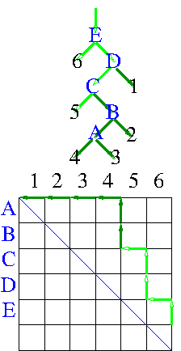

# test_expr
Create random inputs for unix expr and answer it should give. 
Uniformly randomly samples binary trees and then converts them to random arithmetic expressions.

Binary trees of a given size can be sampled rapidly uniformly at random.


A binary is tree is created by random vertical and horizontal moves across square,
starting at a corner and moving towards the diagnoally opposite corner,
keeping above the diagonal [slides](reading_group_bigtree/langdon_sse_15-jan-2020.pdf)
[also](http://www.cs.ucl.ac.uk/staff/W.Langdon/gggp/bigtree/langdon_sse_15-jan-2020.pdf)
The size of the tree is given by the length of the square's sides.
Random vertical and horizontal moves ensure all possible binary trees of the chosen size
are equally likely.
Works for any size tree.
Fast: bench_rand 18,600,000 tree nodes per second
[arXiv:2001.04505](https://arxiv.org/pdf/2001.04505).
(bench_rand is based on GPquick and
for simplicity includes more files from GPquick than it ought to).

bench_rand generates a random binary tree,
which is piped into gawk script test_expr.awk
which converts the tree into an arithmetic expression
which can be used to test the unix expr utility.

# Use
The C++ sources are in directory benchmark

# Compile
In directory benchamrk
```
make -f bench_rand.make
```
Linux make with GCC 11.5.0 will produce many warnings but should
only take a few seconds to produce the executable bench_rand

# Test
In directory expr,
either copy bench_rand or invoke the execuatble in directory ../benchmark
For example, to generate a tree with nine nodes
```
./bench_rand pMaxExpr:9
```
pMaxExpr:9 is command line syntax inhertited from GPquick.
bench_rand should produce output like that in test_len9

To change the default pseudo random number seed also include
pPopSeed:nnn (where nnn is a positive integer) on the bench_rand command line.

The GNU gawk script test_expr.awk can be used to convert
bench_rand's output into an arithmetic expression.
For example on the command line,
use a unix pipe to direct the output of bench_rand
into test_expr.awk
```
./bench_rand pMaxExpr:9 | gawk -f test_expr.awk
```
The output should be as test_len9.expr

# Run

The Linux tsch script test_expr.bat can be used.
It will automate changing the PRNG seed as it generates 60
random expressions for each odd (ie viable) length from 1 to 399
and uses linux expr to evaluate them.
(Expect various errors, such as divide by zero.)
